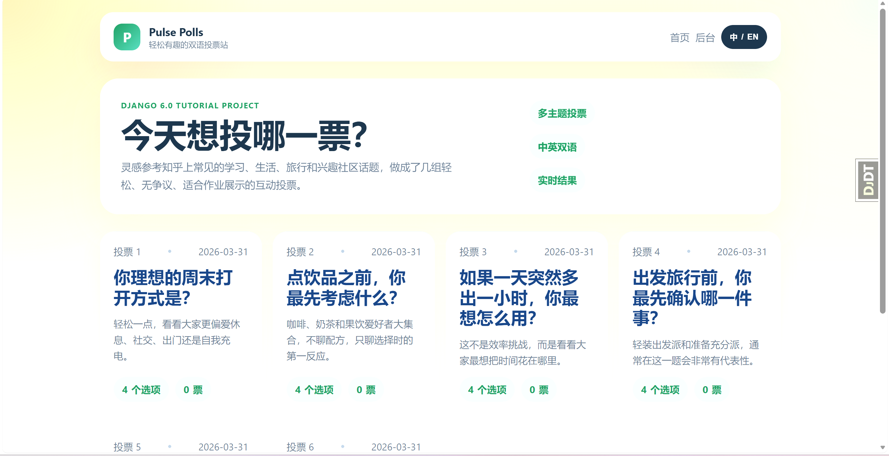
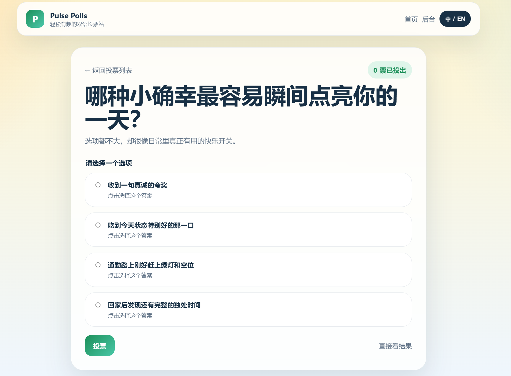
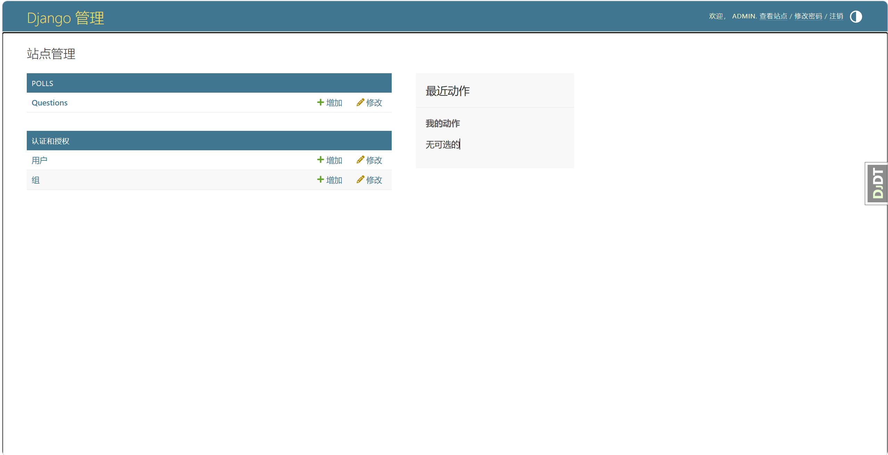

# Django项目实战：手把手实现一个双语投票网站并发布到 GitHub，附完整代码与部署说明

> 作者：倪家诚  
> 日期：2026-03-31  
> GitHub：<https://github.com/XXYoLoong/django-tutorial-pulse-polls>

## SEO 标题建议

- Django项目实战：基于官方Tutorial开发一个双语投票网站，附完整代码与部署说明
- Django入门项目实战：从官方Tutorial到双语投票系统 Pulse Polls 全流程解析
- Django官网Tutorial实践总结：手把手实现一个双语投票网站并发布到 GitHub

## 摘要

本文基于 Django 官方 6.0 Tutorial，从零开始实现经典的 `polls` 投票系统，并在教程原始示例基础上进一步升级为一个支持中英双语切换、具备更完整 UI 展示效果、支持后台管理与自动化测试的双语投票网站 `Pulse Polls`。文章将系统介绍 Django 项目初始化、应用创建、模型设计、数据库迁移、路由配置、视图实现、模板重构、静态资源组织、后台管理、测试验证以及 GitHub 发布全流程，适合 Django 初学者、课程作业实践者以及希望将官方示例升级为可展示作品的开发者阅读参考。

## 封面导语

如果你已经照着 Django 官网 Tutorial 做过 `polls` 项目，那么你可能也会有一个问题：  
“教程是跑通了，但它看起来还是太像教程，怎么把它做成一个更像正式项目、可以拿去交作业、发博客、放 GitHub 展示的作品？”

这篇文章就是围绕这个问题展开的。

我会从 Django 官网 Tutorial 出发，带你把一个基础投票示例，一步步做成一个支持中英双语、界面更完整、内容更丰富、结构更工程化的双语投票网站 `Pulse Polls`。

## 关键词

`Django` `Django Tutorial` `Django项目实战` `Python Web开发` `投票系统` `Django Admin` `Django Template` `SQLite` `双语网站` `课程作业`

## 目录

- 前言
- 一、项目来源与目标
- 二、项目最终效果概览
- 三、开发环境与技术栈
- 四、从 0 到 1：项目是如何搭起来的
- 五、Django Tutorial 的核心知识点是怎么落地的
- 六、为什么要做双语和多投票内容扩展
- 七、后台管理：Django 最实用的地方之一
- 八、测试：不是写完能跑就结束
- 九、我在开发过程中踩过的坑
- 十、工程化补充：seed_polls 命令、README、License、GitHub
- 十一、完整运行方式
- 十二、这个项目让我真正理解了什么
- 十三、结语
- 代码与项目地址

## 前言

最近在完成 Django 课程作业时，我没有只停留在“把官方教程跑通”这个层面，而是尝试把 Django 官网 Tutorial 的原始示例项目继续往前推进，做成一个更完整、更适合作业展示、同时也更适合发布到博客平台的项目。

最终完成的作品，是一个基于 Django 6.0 Tutorial 扩展出来的双语投票网站 `Pulse Polls`。它保留了官网教程的核心结构，又增加了以下内容：

- 更适合展示的首页、详情页、结果页 UI
- 中英双语切换
- 更丰富且安全的投票主题
- 后台管理
- 自动化测试
- 一键生成演示数据命令
- 完整的项目文档、许可证与 GitHub 发布

这篇文章会结合 Django 官方教程的知识体系和我实际落地这个项目的过程，尽量详细地讲清楚：

- Django 官方 Tutorial 到底教了什么
- 我是怎么一步步把项目做出来的
- 我在实现过程中遇到了什么问题
- 我又是如何把一个“示例项目”升级成“可交付项目”的

如果你也在学习 Django，或者你也需要完成类似的课程作业，这篇文章应该会比较有参考价值。

---

## 一、项目来源与目标

### 1. 官方教程来源

本项目实践主要参考 Django 官方中文文档：

- Django 中文教程入口：<https://docs.djangoproject.com/zh-hans/6.0/intro/>

官网 Tutorial 的经典示例是一个投票系统 `polls`。它非常适合入门，因为它覆盖了 Django 的很多核心模块：

- 项目创建
- 应用创建
- URL 配置
- 视图函数与类视图
- 模型设计
- 模板渲染
- 数据库迁移
- 后台管理
- 表单提交
- 自动化测试
- 静态文件
- 第三方工具接入

### 2. 我的实践目标

我给自己的目标不是“照着敲一遍就结束”，而是分成两个层次：

第一层是完成官网 Tutorial 的所有核心内容。  
第二层是在其基础上做展示型升级，让它更像一个真正的项目。

所以最终目标包括：

- 完整实现 Django 官方教程中的 `polls` 系统
- 把页面做得更适合作业展示
- 增加中英双语切换
- 替换掉教程中非常单一的示例内容
- 增加更工程化的命令和文档
- 上传到 GitHub，形成一个可公开展示的作品

---

## 二、项目最终效果概览

这个项目最终实现的是一个双语投票网站，具备以下功能：

- 首页展示多个投票问题卡片
- 点击问题进入详情页
- 选择选项并提交投票
- 查看投票结果与比例条
- 通过后台管理系统维护题目和选项
- 支持中英双语切换
- 可通过命令一键重建演示数据

为了更方便读者快速建立整体认知，我建议你在这一部分放 3 到 4 张核心截图，让文章在平台首页预览时就有足够的吸引力。对于 CSDN 和掘金这类平台来说，首屏的可视化效果往往会直接影响读者是否愿意继续往下读。

【插图位置 1：这里插入网站主页截图，对应 `assets/screenshot-home-zh.png`】  
注释建议：展示升级后的首页 UI，包括投票卡片、双语切换按钮和站点标题。



【插图位置 2：这里插入投票详情页截图，对应 `assets/screenshot-detail-zh.png`】  
注释建议：展示题目说明、选项卡片、投票按钮等交互区域。



【插图位置 3：这里插入后台管理界面截图，对应 `assets/screenshot-admin-zh.png`】  
注释建议：展示 Django Admin 中题目与选项的维护效果。



---

## 三、开发环境与技术栈

### 1. 开发环境

- 操作系统：Windows
- Python：3.14.3
- Django：6.0.3
- 数据库：SQLite3
- 编辑环境：本地工作区 `f:\YL-Workspace\Z-1`

### 2. 使用到的主要技术

- Django 6.0
- SQLite
- Django Template
- Django Admin
- Django Test Framework
- django-debug-toolbar
- HTML + CSS + JavaScript
- Git + GitHub

### 3. 项目仓库

项目已发布到 GitHub：

- <https://github.com/XXYoLoong/django-tutorial-pulse-polls>

---

## 四、从 0 到 1：项目是如何搭起来的

### 1. 创建虚拟环境

在 Python Web 项目中，使用虚拟环境几乎是标准操作。这样做的好处很明显：

- 依赖不会污染全局环境
- 项目更容易迁移和复现
- 不同项目的依赖版本可以互相隔离

命令如下：

```powershell
python -m venv .venv
```

然后安装 Django：

```powershell
.\.venv\Scripts\python.exe -m pip install Django==6.0.3
```

### 2. 创建 Django 项目

初始化项目：

```powershell
.\.venv\Scripts\django-admin.exe startproject mysite .
```

这里会生成：

- `manage.py`
- `mysite/settings.py`
- `mysite/urls.py`
- `mysite/asgi.py`
- `mysite/wsgi.py`

这一步之后，Django 项目的基本骨架就有了。

### 3. 创建 polls 应用

在 Django 中，一个项目下通常会有多个应用，`polls` 就是其中一个业务模块。

创建命令：

```powershell
.\.venv\Scripts\python.exe manage.py startapp polls
```

然后在 `settings.py` 中把它加入：

```python
INSTALLED_APPS = [
    ...
    "polls.apps.PollsConfig",
]
```

---

## 五、Django Tutorial 的核心知识点是怎么落地的

### 1. 模型设计：Question 与 Choice

官网教程最经典的一部分，就是设计投票题目与选项的模型关系。

我在 `polls/models.py` 中定义了两个核心模型：

- `Question`
- `Choice`

它们之间是一对多关系：

- 一个 `Question` 可以对应多个 `Choice`
- 一个 `Choice` 只属于一个 `Question`

模型的核心作用有两个：

- 描述数据结构
- 让 Django 自动为数据库生成对应表结构

在扩展版项目中，我还增加了这些字段：

- `question_text_en`
- `description`
- `description_en`
- `choice_text_en`

这样就可以实现双语展示。

【插图建议 5：models.py 关键代码截图】  
注释建议：展示 Question 和 Choice 模型，以及双语字段的设计。

### 2. 迁移机制：让代码和数据库同步

模型写完以后，不能直接运行，还需要迁移数据库。

相关命令：

```powershell
.\.venv\Scripts\python.exe manage.py makemigrations polls
.\.venv\Scripts\python.exe manage.py migrate
```

这一步会生成迁移文件，并把它们应用到数据库里。

在这个项目中，一共生成了两次核心迁移：

- 初始表结构迁移
- 双语字段扩展迁移

这也是 Django 很有代表性的一个优势：模型驱动数据库结构演进。

### 3. URL 分发：请求是如何进入对应页面的

Django 的 URL 分发机制非常清晰。

项目级路由在 `mysite/urls.py` 中完成：

- `/` 跳转到投票首页
- `/polls/` 进入投票系统
- `/admin/` 进入后台管理

应用级路由在 `polls/urls.py` 中完成：

- `/polls/` 列表页
- `/polls/<id>/` 详情页
- `/polls/<id>/results/` 结果页
- `/polls/<id>/vote/` 投票提交

我还额外处理了一个用户体验问题：  
兼容了不带末尾斜杠的访问方式，比如 `/polls/1`，避免用户直接输入地址时出现 404。

### 4. 视图：页面逻辑在哪里实现

在官网教程中，视图是 Django 的核心之一。

我在项目里使用了 Django 的泛型类视图：

- `IndexView`
- `DetailView`
- `ResultsView`

这样写的好处是：

- 结构清晰
- 代码更简洁
- 对于列表页和详情页这类标准模式特别方便

同时保留了一个函数视图 `vote()` 来处理表单提交逻辑，因为投票动作涉及：

- 读取 POST 数据
- 校验用户是否选择选项
- 增加票数
- 跳转到结果页

这里我还使用了 `F("votes") + 1`，这是 Django ORM 中比较规范的字段自增写法。

【插图建议 6：views.py 核心代码截图】  
注释建议：展示泛型类视图和 vote 提交逻辑。

### 5. 模板：从“教程页面”升级到“展示页面”

官网 Tutorial 的模板部分主要目标是教学，所以页面结构非常简洁，甚至可以说朴素。

为了让项目更适合作业展示，我做了以下升级：

- 新增统一布局模板 `base.html`
- 首页改为卡片式投票列表
- 详情页加入说明文本、按钮和更完整的表单区
- 结果页加入可视化比例条
- 整体视觉使用更现代的卡片布局和渐变背景

这些改造并没有破坏 Django Template 的基本工作方式，反而更好地体现了模板继承、变量渲染和结构复用。

【插图建议 7：首页模板结构截图】  
注释建议：展示 base.html + index.html 的模板继承方式。

### 6. 静态资源：CSS 与 JavaScript

项目使用 Django 的静态文件机制管理 CSS 和 JS：

- `polls/static/polls/style.css`
- `polls/static/polls/app.js`

CSS 部分主要负责：

- 布局
- 渐变背景
- 卡片样式
- 结果条可视化
- 移动端适配

JavaScript 部分主要负责：

- 处理中英双语切换
- 使用 `localStorage` 记住当前语言

这种设计比较适合课程作业，因为：

- 不依赖复杂前端框架
- 仍然保留了 Django 模板项目的轻量结构
- 易于解释、易于维护

---

## 六、为什么要做双语和多投票内容扩展

如果严格按照官网 Tutorial，页面上通常只有很少量、很基础的示例内容。  
从“学习 Django”角度当然足够，但如果是课程作业展示，会显得有点单薄。

所以我做了两类扩展：

### 1. 中英双语支持

双语支持主要体现两个层面：

- 数据层面增加中英文字段
- 前端层面提供语言切换按钮

这样带来的价值是：

- 页面更完整
- 展示效果更强
- 更适合在作业答辩中说明“我做了扩展设计”

### 2. 多组安全有趣的投票主题

我没有使用争议性话题，而是选择更轻松的日常类题目，例如：

- 理想周末怎么过
- 点饮品最先考虑什么
- 多出一小时会怎么安排
- 出发旅行前先检查什么
- 学习时喜欢什么陪伴
- 哪种小确幸最容易点亮一天

这些题目的好处是：

- 无争议
- 易共鸣
- 适合演示
- 更符合一个面向同学和老师展示的课程作业场景

---

## 七、后台管理：Django 最实用的地方之一

Django Admin 是我认为 Django 最有代表性的功能之一。

只要模型定义清晰、后台注册得当，你很快就能拥有一个可用的数据管理系统。

在这个项目里，我配置了：

- `QuestionAdmin`
- `ChoiceInline`
- 列表显示
- 搜索
- 筛选

这样在后台就可以直接：

- 新增题目
- 编辑双语内容
- 维护选项
- 查看发布时间

对于课程作业而言，这一点非常加分，因为它说明项目不仅“前台能看”，而且“后台能管”。

【插图说明补充：如果你在前文已经展示过后台截图，这里可以不重复插图，只保留文字说明；如果希望增强说服力，也可以再次放置 `assets/screenshot-admin-zh.png` 作为后台配置展示图。】

---

## 八、测试：不是写完能跑就结束

官网 Tutorial 非常强调测试，这一点我觉得特别好。

在本项目中，我保留并扩展了测试部分，验证了这些关键逻辑：

- `was_published_recently()` 的时间判断是否正确
- 首页是否只展示已发布问题
- 未来发布时间的问题是否不会出现在详情页

运行测试命令：

```powershell
.\.venv\Scripts\python.exe manage.py test
```

最终结果：

- 共 10 项测试
- 全部通过

这一步非常重要，因为它代表项目不仅“看起来能跑”，而且“逻辑上经过验证”。

---

## 九、我在开发过程中踩过的坑

做项目时最有价值的部分，往往不只是“完成了什么”，还有“遇到了什么问题、怎么解决”。

### 1. 根路径访问 404

问题表现：

- 打开 `127.0.0.1:8000/` 时出现 404

原因：

- 初始配置只注册了 `/polls/`，没有给 `/` 配置路由

解决方式：

- 在项目级路由中把根路径重定向到 `polls:index`

### 2. `/polls/1` 显示 Not Found

问题表现：

- 点击或手动输入不带尾部斜杠的路径时无法访问

原因：

- Django 默认配置中主要使用的是带斜杠形式

解决方式：

- 在应用级路由中兼容不带斜杠的访问

### 3. 演示数据出现重复

问题表现：

- 首页出现两条几乎一样的投票题目

原因：

- 之前插入示例数据时执行了两次

解决方式：

- 清理重复题目，只保留规范数据

### 4. 文案更新后测试失败

问题表现：

- 页面改成中文后，原来测试里断言的英文文案不再匹配

解决方式：

- 同步调整测试内容，让断言与当前页面状态一致

这些问题其实都很典型，也很适合写进作业说明或博客文章，因为它们能体现项目实践的真实过程。

---

## 十、工程化补充：seed_polls 命令、README、License、GitHub

为了让项目更完整，我又补了几件很适合“交作业”和“公开展示”的内容。

### 1. 一键生成数据命令

我新增了：

```powershell
python manage.py seed_polls
```

这个命令可以：

- 清空旧题目
- 重建 6 组双语投票
- 自动写入 24 个选项

这对于演示和验收非常方便。

### 2. 中英文 README

我分别补了：

- `README.md`
- `README.en.md`

里面包含：

- 作者信息
- 运行方式
- 后台账号
- 项目亮点
- 许可证说明

### 3. Apache License 2.0

项目采用 Apache License 2.0。  
这一步的意义在于：

- 项目结构更规范
- 仓库发布更完整
- 更符合开源项目的基本习惯

### 4. 发布到 GitHub

最终我把项目发布到了 GitHub：

- <https://github.com/XXYoLoong/django-tutorial-pulse-polls>

这一步非常值得做，因为它让课程作业从“本地文件夹”升级成了“可分享、可查看、可复现的项目作品”。

---

## 十一、完整运行方式

如果你想把这个项目跑起来，可以按照下面的步骤执行：

```powershell
python -m venv .venv
.\.venv\Scripts\python.exe -m pip install -r requirements.txt
.\.venv\Scripts\python.exe manage.py migrate
.\.venv\Scripts\python.exe manage.py seed_polls
.\.venv\Scripts\python.exe manage.py runserver
```

启动后访问：

- 首页：<http://127.0.0.1:8000/>
- 投票页：<http://127.0.0.1:8000/polls/>
- 后台：<http://127.0.0.1:8000/admin/>

后台账号：

- 用户名：`admin`
- 密码：`Admin123456!`

如果你准备把这个项目作为课程作业提交，建议你在运行前再额外做两件事：

- 先执行一次 `python manage.py test`，确保所有测试通过
- 再执行一次 `python manage.py seed_polls`，保证演示数据是完整的、统一的

这样在老师现场查看时，页面内容会更完整，展示效果也更稳定。

---

## 十二、这个项目让我真正理解了什么

如果只看官网教程，可能会觉得 Django 只是“建模、写视图、配模板”。  
但真正把项目从教程做到可展示之后，我更深地理解了这些点：

### 1. Django 的强项在于“完整性”

它不是只解决某一个小点，而是把：

- 后端逻辑
- 数据模型
- 后台管理
- 模板渲染
- 表单处理
- 测试机制

整合成了一整套开发框架。

### 2. 官网 Tutorial 真的是入门最佳路径之一

很多教程会只讲概念，但 Django 官方 Tutorial 是一边做一边教。  
你不仅能看懂，还能真的做出东西。

### 3. 一个作业项目要有“展示意识”

如果只是把代码写出来，项目往往显得生硬。  
但当你再往前多做一步：

- 优化 UI
- 丰富内容
- 增加文档
- 补充测试
- 发布到 GitHub

这个项目的完整度就会完全不一样。

---

## 十三、结语

这次 Django 项目实践，本质上是一次从“官方示例”走向“可交付作品”的过程。

我从 Django 官网 Tutorial 出发，完成了一个具备真实展示价值的双语投票网站，也在这个过程中系统梳理了 Django 的项目结构、模型设计、路由机制、视图逻辑、模板渲染、后台管理、静态资源、自动化测试和工程化发布流程。

如果你也在学习 Django，我非常建议你不要只停留在“照着教程敲完”这一步，而是试着像这次这样，继续把项目往前推进一点点。很多真正的收获，往往就藏在这“一点点”里。

> 真正拉开项目完成度差距的，往往不是“有没有做完教程”，而是“有没有把教程继续做成作品”。

---

## 代码与项目地址

项目已开源，欢迎查看、交流与 Star：

- GitHub：<https://github.com/XXYoLoong/django-tutorial-pulse-polls>

如果这篇文章对你有帮助，也欢迎关注我的 GitHub，一起交流 Django、Python 和项目实践。

## 发布建议

为了让这篇文章在 CSDN、掘金或个人博客平台上有更好的表现，发布时还可以再配合以下策略：

- 封面主标题建议使用：`从 Django 官方Tutorial到双语投票网站：一个课程作业的完整升级过程`
- 简介文案建议强调：`附源码、完整流程、测试、后台管理、GitHub 仓库`
- 标签建议使用：`Django`、`Python`、`Web开发`、`项目实战`、`课程作业`
- 首图建议选择：首页 UI 全屏图，视觉冲击力最好

如果你想进一步了解源码，或者直接把项目拉下来自己运行，欢迎访问我的 GitHub：

- <https://github.com/XXYoLoong/django-tutorial-pulse-polls>
