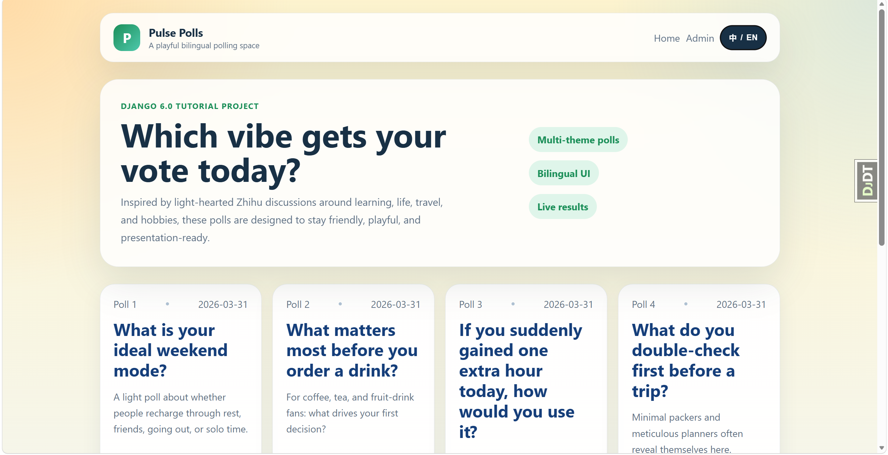
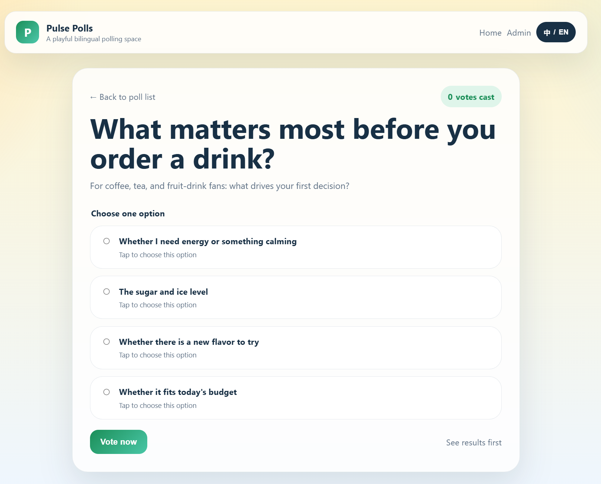

# Django Tutorial Pulse Polls

This project is based on the official Django 6.0 tutorial and extended into a bilingual polling website for course presentation.

## Author

- Name: Ni Jiacheng
- Chinese Name: 倪家诚
- GitHub: XXYoLoong / 游龙
- Date: 2026-03-31

## CSDN Article

- Article Title: `Django项目实战：手把手实现一个双语投票网站并发布到 GitHub，附完整代码与部署说明`
- CSDN Link: `To be added after publication`

## Features

- Implements the core workflow of the official Django tutorial
- Includes poll list, detail page, vote submission, results page, and admin site
- Supports Chinese and English language switching
- Upgraded UI for index, detail, and results pages
- Ships with 6 safe, light-hearted bilingual demo polls
- Provides a `seed_polls` command for rebuilding demo data quickly

## Screenshots

### Home Page



### Poll Detail Page



### Django Admin Panel


## Requirements

- Python 3.14.3
- Django 6.0.3
- django-debug-toolbar 6.2.0

## Setup and Run

```powershell
python -m venv .venv
.\.venv\Scripts\python.exe -m pip install -r requirements.txt
.\.venv\Scripts\python.exe manage.py migrate
.\.venv\Scripts\python.exe manage.py seed_polls
.\.venv\Scripts\python.exe manage.py runserver
```

After startup, open:

- Home: `http://127.0.0.1:8000/`
- Polls: `http://127.0.0.1:8000/polls/`
- Admin: `http://127.0.0.1:8000/admin/`

## Admin Account

- Username: `admin`
- Password: `Admin123456!`

## Useful Commands

```powershell
.\.venv\Scripts\python.exe manage.py check
.\.venv\Scripts\python.exe manage.py test
.\.venv\Scripts\python.exe manage.py seed_polls
```

## Project Files

```text
Z-1/
├─ assets/
├─ mysite/
├─ polls/
├─ demo.md
├─ manage.py
├─ README.md
├─ README.en.md
├─ LICENSE
└─ requirements.txt
```

## Process Log

See [demo.md](./demo.md) for the full implementation and troubleshooting record.

## License

This project is licensed under the Apache License 2.0. See [LICENSE](./LICENSE).
